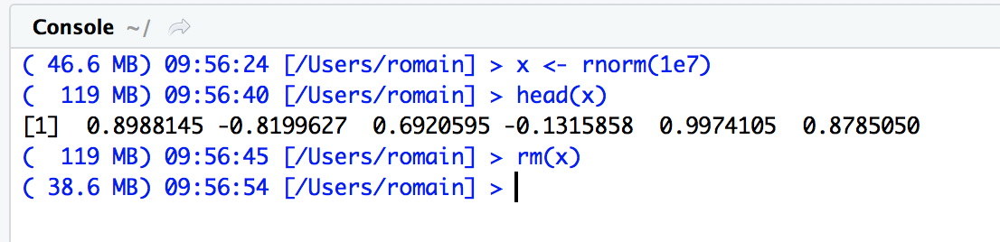

# prompt

Dynamic Prompt. The idea is to leverage `addTaskCallback` to update the prompt 
dynamically, e.g. 

```r
addTaskCallback(function(expr, value, ok, visible) {
prompt <- sprintf( "(%s) %s [%s] > ", 
    capture.output(print(pryr::mem_used())), 
    format( Sys.time(), "%H:%M:%S" ), 
    getwd()
  ) 
  options( prompt = prompt)
TRUE
})
```



in a way that can be configured. Things we might want to display: 

- current time
- memory used `pryr::mem_used`
- current working directory, maybe slightly differently when it's not the directory of the current rstudio project
- are we developping a package ? Do we need to rebuild it ? 
- are we sync with github
- R version
- ...
- (please add your own with PR)

## Installation

```
install_github( "ThinkRstat/prompt" )
```

## Usage

```r
library(prompt)
```

## License

MIT + file LICENSE © 
